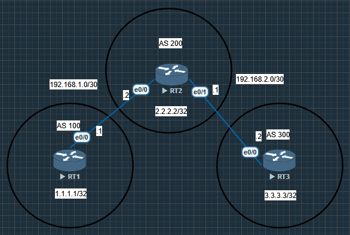

## eBGP Lab: Multi-AS BGP Implementation

### Project Overview

This project focused on implementing pure eBGP (External Border Gateway Protocol) across three routers, each representing a different Autonomous System (AS). The objective was to establish inter-domain routing and understand how BGP propagates routes between different administrative domains.

### Addressing Scheme

Router	AS Number	Interfaces	Loopback
Router1	100	eth0/0: 192.168.1.1/30	1.1.1.1/32
Router2	200	eth0/0: 192.168.1.2/30
eth0/1: 192.168.2.1/30	2.2.2.2/32
Router3	300	eth0/0: 192.168.2.2/30	3.3.3.3/32

### Network Diagram

### Key eBGP Concepts Demonstrated

Concept	How It Was Demonstrated
eBGP Peering	Direct BGP sessions between different AS numbers (100↔200, 200↔300)
AS Path Attribute	Visible in BGP tables: Router1 sees 3.3.3.3 with path "200 300"
Route Propagation	Routes advertised hop-by-hop through AS 200
Next-Hop Behavior	eBGP advertises routes with next-hop set to the peering interface
Loop Prevention	AS Path attribute prevents routing loops
Best Path Selection	Shortest AS Path wins (direct vs. multi-hop paths)

### Challenges and Solutions
Challenge	Solution
Initial BGP sessions not establishing	Verified physical connectivity and correct IP addressing
Routes not appearing in BGP tables	Ensured network statements matched exactly with loopback addresses
AS Path showing correctly	Verified through show ip bgp command on each router
End-to-end ping failures	Checked return path routing and ensured all routers had routes back

### Skills Acquired

✅ Configuring eBGP between multiple Autonomous Systems

✅ Understanding AS Path attribute and its role in loop prevention

✅ BGP route advertisement and propagation

✅ Verifying BGP operation with show ip bgp, show ip bgp summary

✅ Troubleshooting BGP peering issues

✅ Testing end-to-end connectivity across multiple AS hops

### Why This Matters
This simple three-router eBGP lab demonstrates the fundamental principles of how the internet works. Every time you visit a website, your packets traverse multiple Autonomous Systems using the exact same BGP principles shown here. ISPs, content providers, and large enterprises all use BGP to exchange routing information and maintain global connectivity.

### Final Network Status

The completed lab achieved:

✅ All three BGP peers established

✅ Full BGP tables with all networks learned

✅ Complete IP reachability between all loopbacks

✅ Understanding of AS Path accumulation

✅ Working end-to-end connectivity across multiple AS hops

### This project provides a solid foundation for understanding more complex BGP topics like route filtering, path manipulation, BGP attributes, and iBGP implementation.