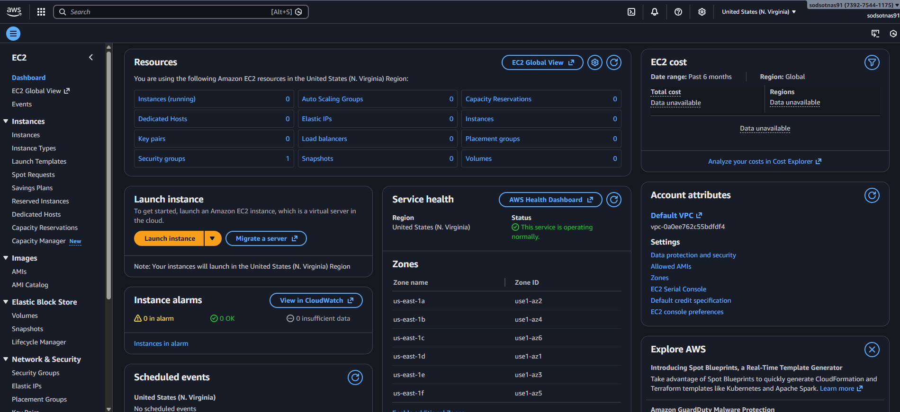
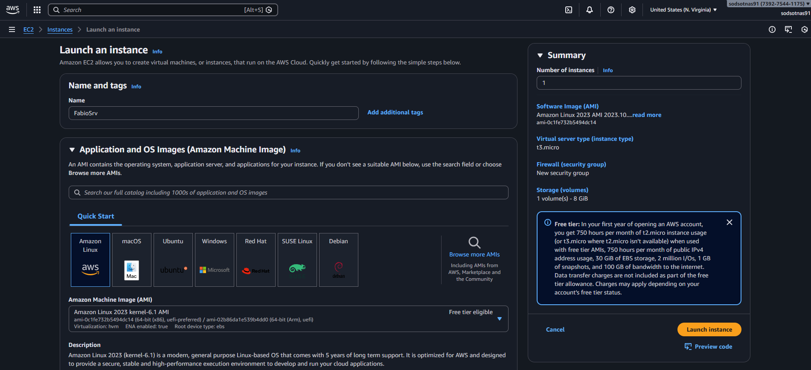
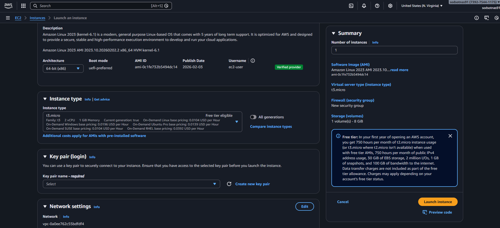
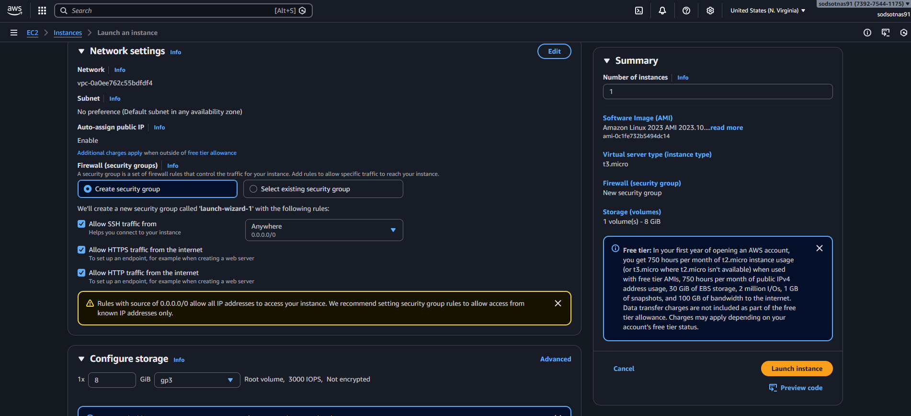
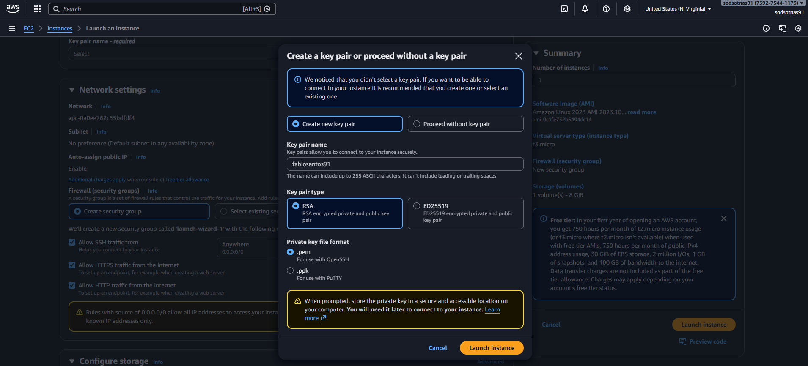
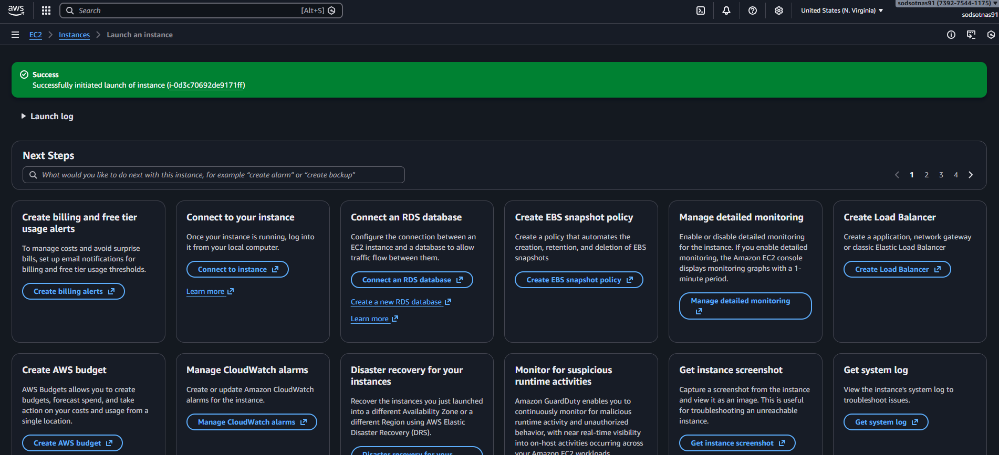

## EC2 AWS Cloud Lab

### Overview

In this lab, I deployed a fully functional web server on Amazon Web Services using an EC2 instance. The goal was to understand the fundamentals of cloud infrastructure, instance management, and public web hosting.

### Environment Setup

I launched a Linux-based EC2 instance (Amazon Linux).

Configured networking using a public subnet, an internet gateway, and appropriate security group rules.

Allowed inbound HTTP traffic on port 80 to make the web server accessible externally.

### Server Configuration

Installed the httpd (Apache) web server package.

Enabled and started the service to ensure it runs on boot.

Deployed a simple website by placing custom HTML content in /var/www/html/.

### Public Deployment

Retrieved the instance’s public IP / DNS.

Verified that the website was reachable from the public internet.

Confirmed that the EC2 instance successfully served web content externally.

### Outcome

This lab demonstrated the complete workflow of:
- Provisioning cloud compute resources,
- Configuring a Linux server,
- Installing and managing web services,
- Exposing a website to the internet.

### It provided hands-on experience with AWS infrastructure, networking, and basic web hosting in a cloud environment.
