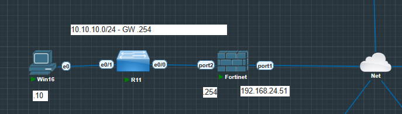
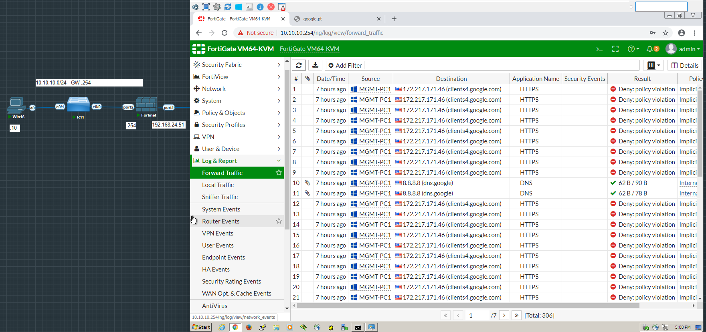
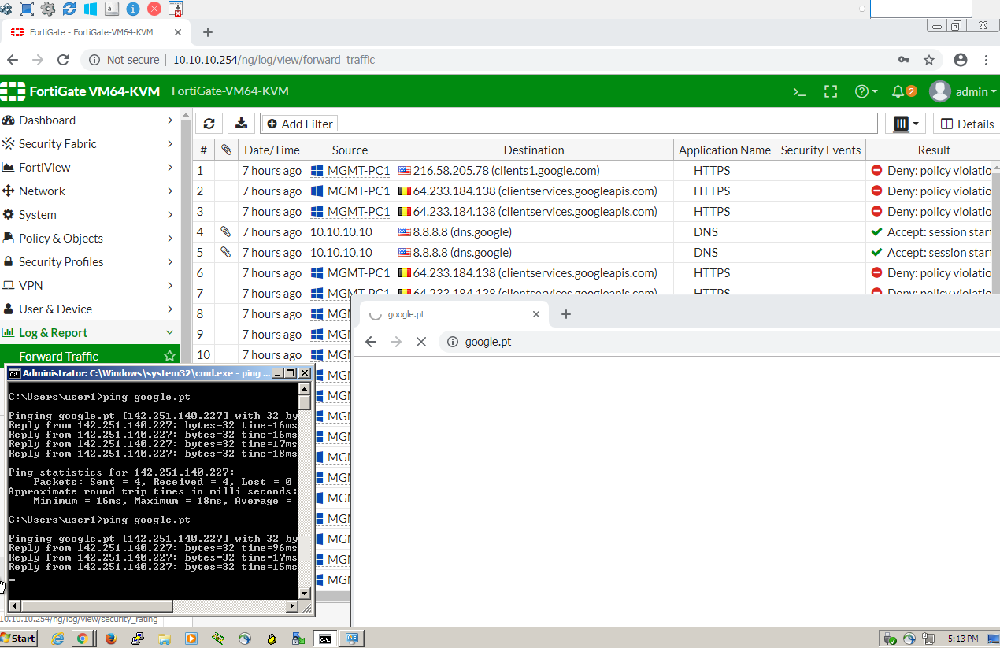

# Fortinet - FortiGate

## Manual Installation

### Network Diagram

### Summary

Decided to play abit with ACLs.
On this lab I created policy to let the internal network(pc) to resolve the google dns and ping but restricted the access via http and https.
Also mad a connection via trunk, so pc is on vlan 10, switch has an access link and another link to the fortigate which has a vlanid 10.
It was really fun to play with these setups.

## Simple ACLs configurations

### Testing conectivities

