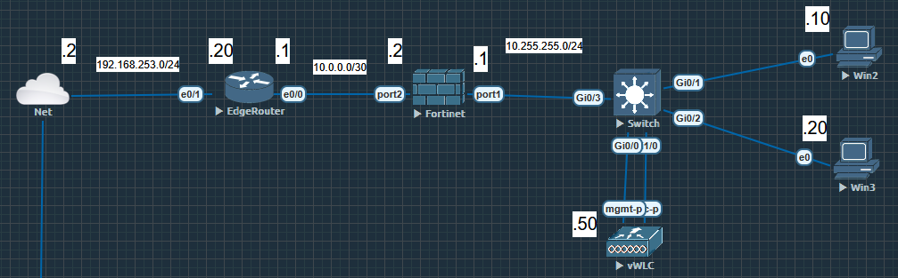
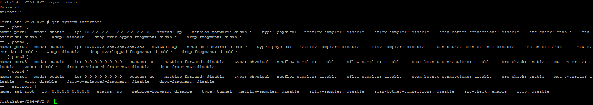
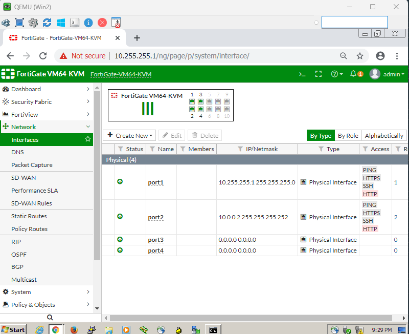
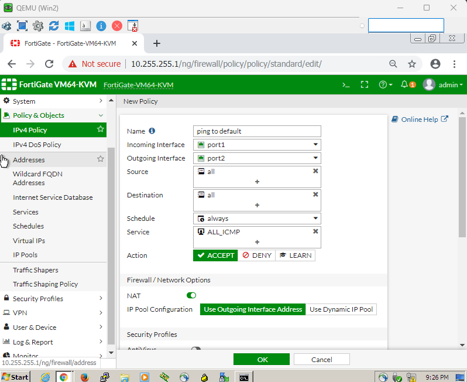
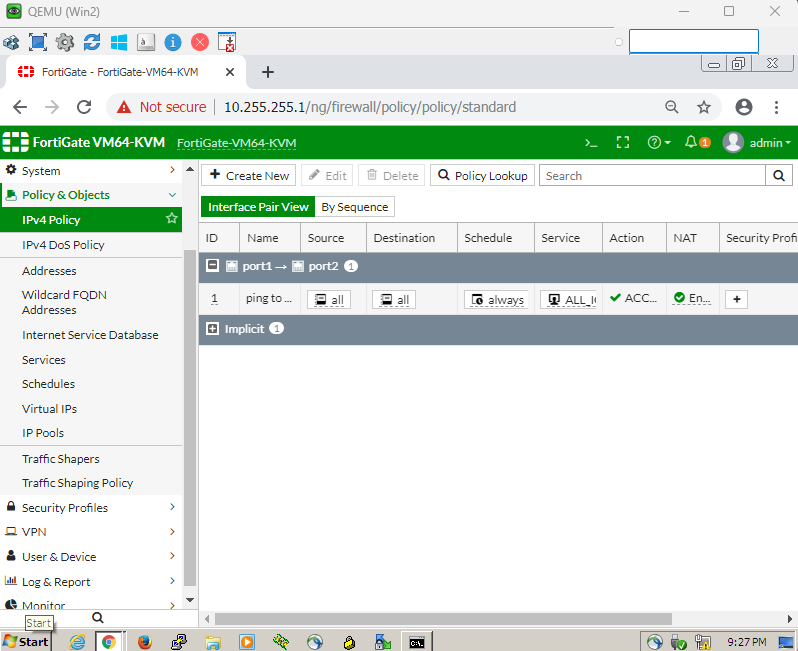
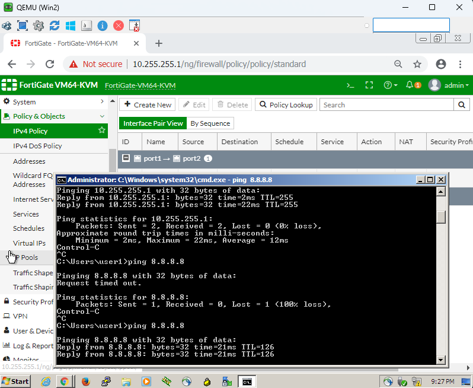
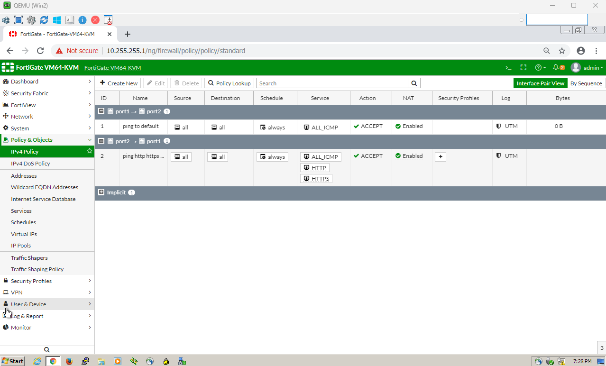
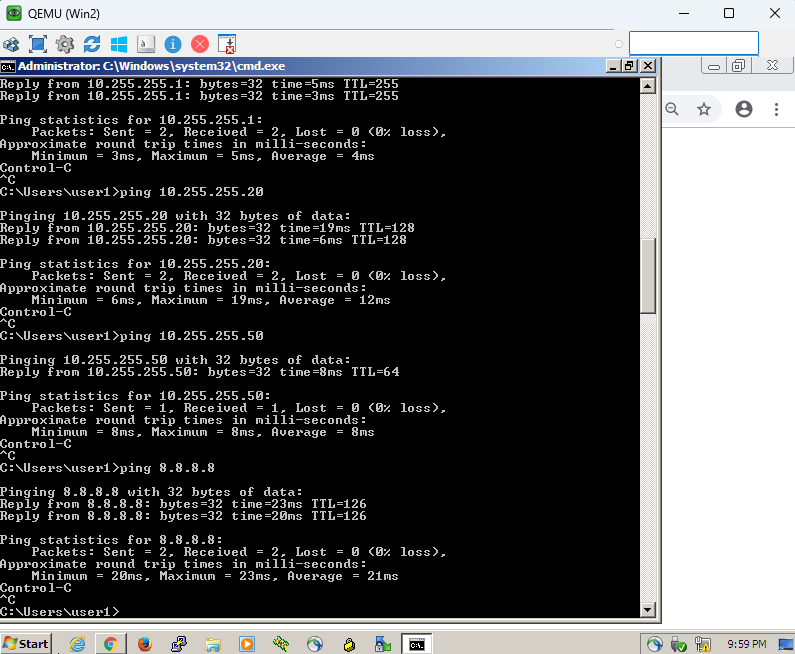
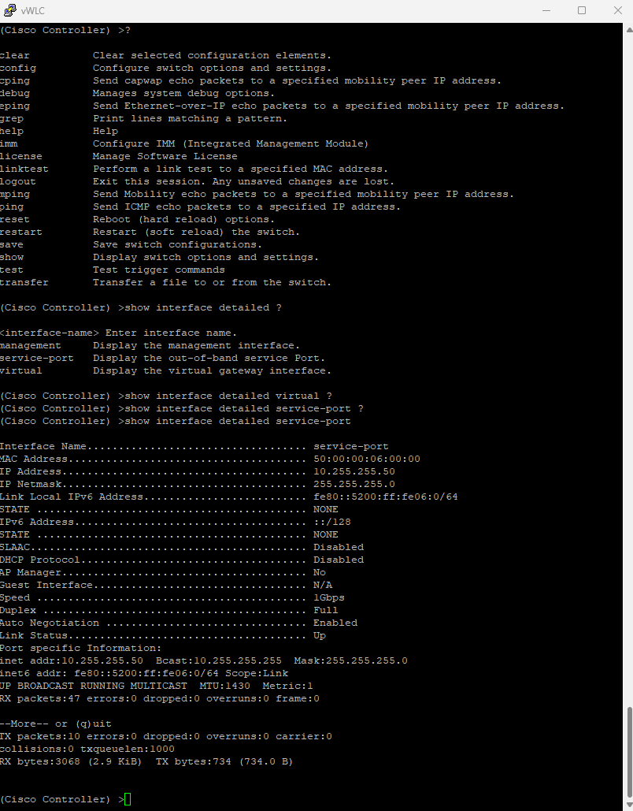

# Fortinet - FortiGate

## Manual Installation

### Network Diagram

## Initial Setup

config system interface
    edit "port1"
    set mode static
    set ip <NEW_IP_ADDRESS> <SUBNET_MASK>
    set allowaccess ping https ssh
    set description "Your Description"
    next
end

config system interface
    edit "port2"
    set mode static
    set ip <NEW_IP_ADDRESS> <SUBNET_MASK>
    set allowaccess ping https ssh
    set description "Your Description"
    next
end

## Simple ACLs configurations

### Testing conectivities

### Extra - Cisco WLC initial setup

