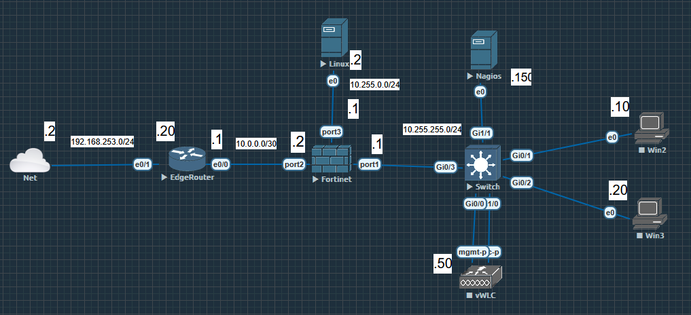
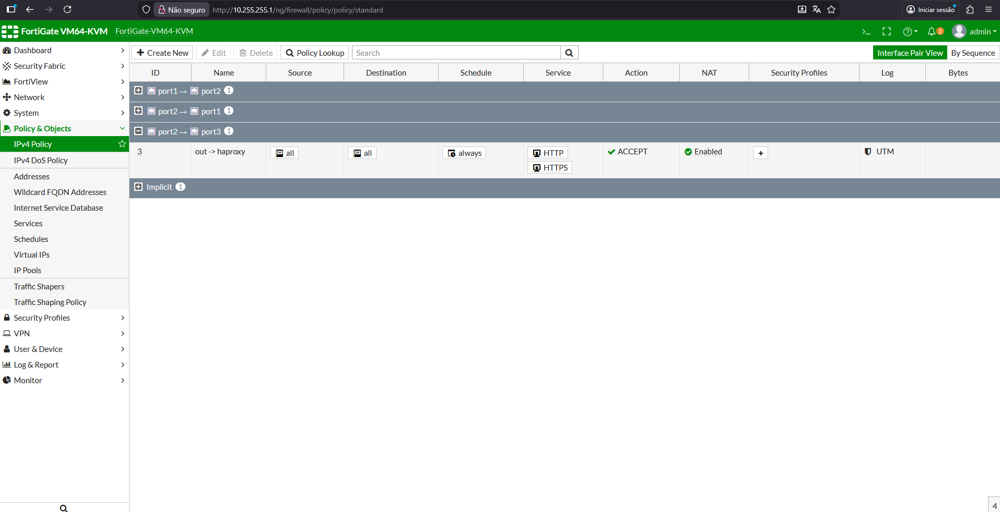
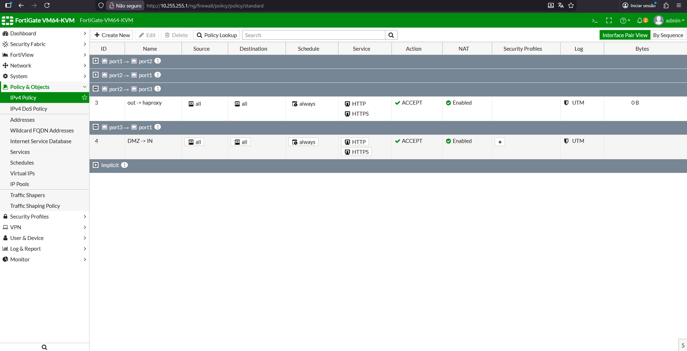
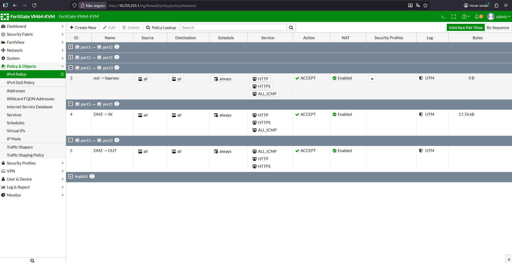
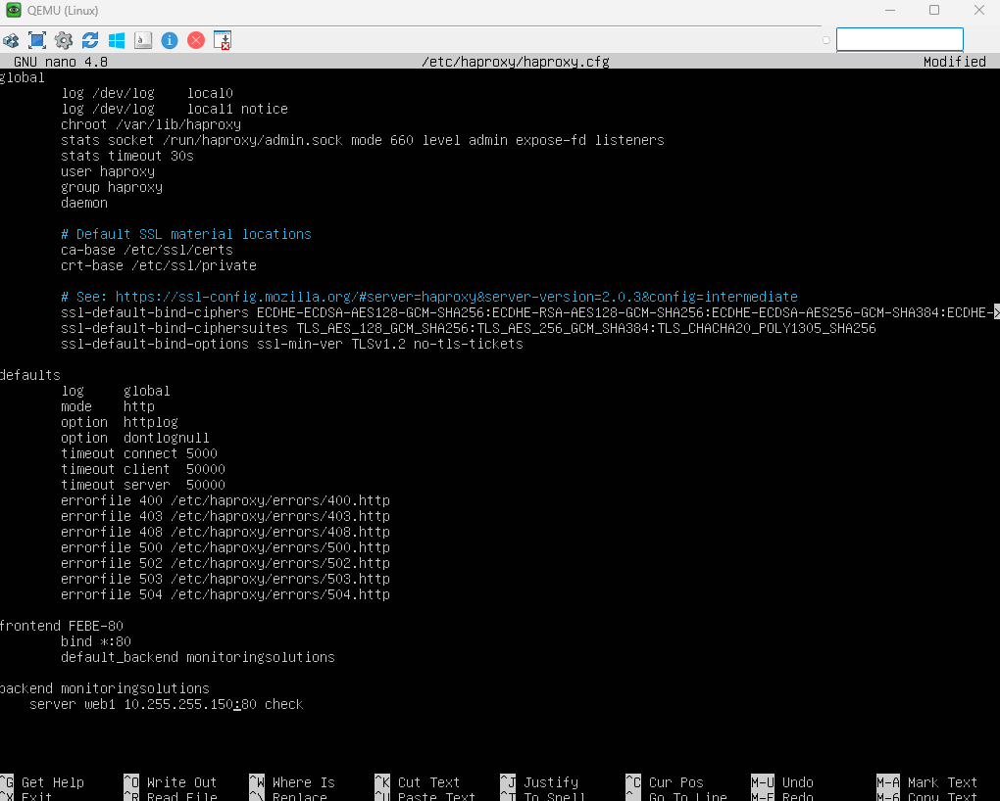
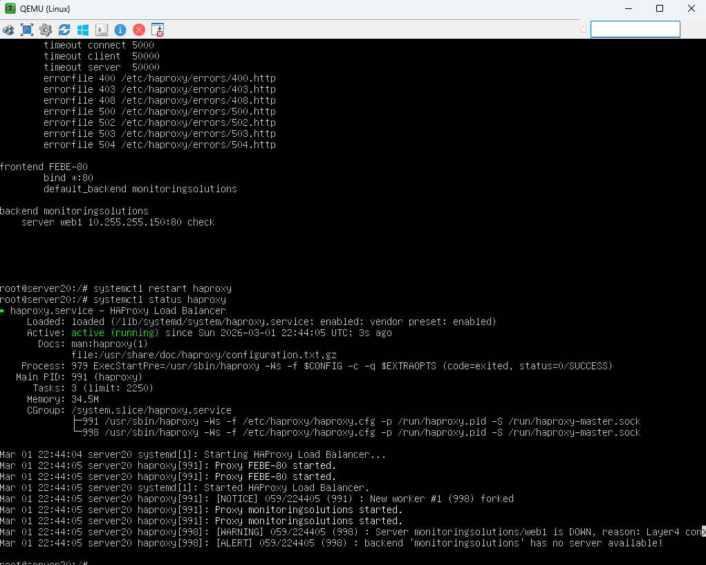
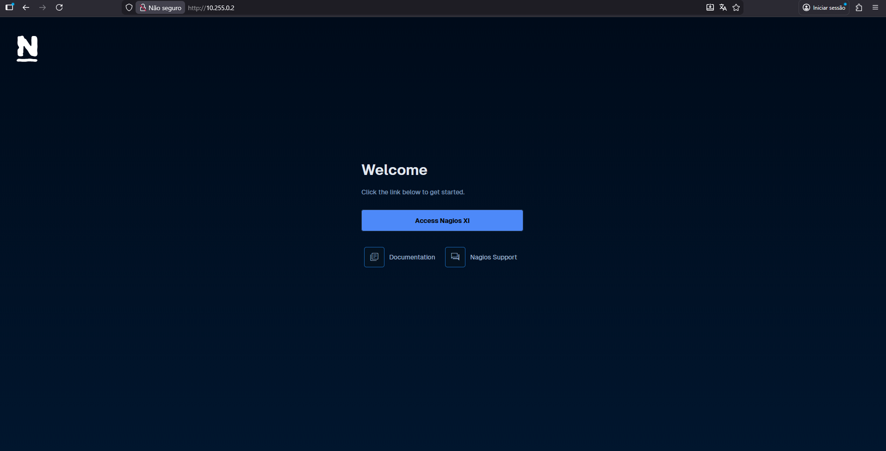

## HAProxy - Reverse Proxy

## Overview

This lab demonstrates the deployment of HAProxy as a reverse proxy within a segmented network architecture designed to securely expose an internal service—Nagios, located in the LAN—to external users. The goal is to provide controlled access while maintaining strong security boundaries between the DMZ and the internal network.

The environment integrates three key components working together:

- EdgeRouter as the perimeter router.

- Fortigate firewall enforcing security policies and network segmentation.

- HAProxy positioned in the DMZ, acting as the reverse proxy and the only externally accessible point for the Nagios service.

This setup follows best practices for secure service publishing, ensuring that the Nagios server remains isolated and never directly reachable from the outside.

## Lab

The lab environment was designed to simulate a realistic enterprise network with multiple security zones and controlled traffic flow.

Key elements of the LAB:

- EdgeRouter handling routing between the Internet and the firewall.

- Fortigate configured with separate zones (WAN, DMZ, LAN) and strict access policies.

- HAProxy server deployed in the DMZ, receiving external traffic and forwarding it to the internal Nagios server.

- Nagios server located in the LAN, accessible only through HAProxy.

- External client used to validate access to Nagios through the reverse proxy.

HAProxy was configured to accept HTTP/HTTPS requests and forward them to the Nagios backend, ensuring that no direct traffic reaches the internal network.

## Network Diagram

## Firewall Configs

The Fortigate firewall is responsible for enforcing security boundaries and controlling traffic between zones. Only essential traffic is allowed.

Main firewall policies:

- WAN → DMZ  
Allows inbound HTTP/HTTPS traffic to the HAProxy server. Security inspection can be enabled depending on the scenario.

- DMZ → LAN  
Allows only HTTP/HTTPS traffic from the HAProxy server to the Nagios server.
The rule is restricted by:
- Source IP: HAProxy
- Destination IP: Nagios
- Specific allowed services, logging is enabled for auditing.

- LAN → DMZ/WAN  
Standard outbound policies for updates and internal communication.

NAT is applied only on the WAN interface, while the DMZ and LAN use private addressing without external exposure.

Explanation:

- The EdgeRouter forwards external traffic to the Fortigate.

- The Fortigate applies security policies and separates the network into zones.

- The HAProxy server in the DMZ receives external requests.

- The Nagios server remains protected inside the LAN, reachable only through HAProxy.

## HAProxy Configs

The following diagram represents the logical flow of traffic and the network segmentation:

Service restart/reload and status

## Accessing Nagios through the HAProxy Reverse Proxy

Once HAProxy is configured, external users access Nagios through a single public endpoint exposed by the reverse proxy.

Traffic flow:

- The user accesses http(s)://public-ip/nagios.

- The EdgeRouter forwards the request to the Fortigate firewall.

- The Fortigate validates the security policy and allows the request to reach the HAProxy server in the DMZ.

- HAProxy processes the request and forwards it to the Nagios server in the LAN.

- Nagios responds to HAProxy, which then returns the response to the external client.

This architecture ensures:

- The Nagios server is never directly exposed to the Internet.

- All external access is centralized and controlled through HAProxy.

- Additional security layers (TLS termination, ACLs, rate limiting, logging) can be applied at the reverse proxy.